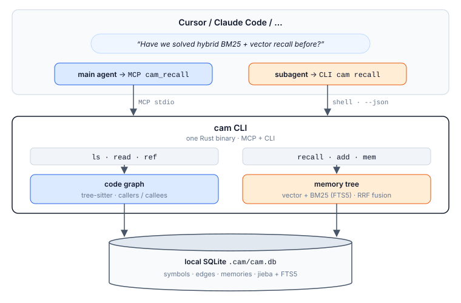

<div align="center">

# cam

[English](README.md) · [中文](README.zh.md)

### Fewer tokens, fewer tool round-trips — one local memory is all it takes

**Code graph + memory · surgical reads · 100% local · MCP + CLI**

**Kernel written in Rust**

[](https://opensource.org/licenses/MIT)
[](https://www.rust-lang.org/)
[](#get-started)

[](#supported-platforms)
[](#supported-platforms)
[](#supported-platforms)

[](#supported-agents)
[](#supported-agents)
[](#supported-agents)
[](#supported-agents)
[](#supported-agents)
[](#supported-agents)
[](#supported-agents)
[](#supported-agents)

</div>

## Contents

- [Why cam?](#why-cam)
- [Get Started](#get-started)
- [Benchmarks](#benchmarks)
- [Key Features](#key-features)
- [How It Works](#how-it-works)
- [Agent Workflow](#agent-workflow)
- [CLI Reference](#cli-reference)
- [Memory Rules](#memory-rules)
- [Configuration](#configuration)
- [Supported Platforms](#supported-platforms)
- [Supported Agents](#supported-agents)
- [Supported Languages](#supported-languages)
- [License](#license)

Usage details: [main agent vs subagent](docs/agents.md) · [MCP configs for each IDE](docs/mcp.md) · [中文说明](docs/agents.zh.md)

## Why cam?

When an AI agent needs to understand code — or reuse what it already learned about this project — it discovers structure the slow way: grep, glob, and Read, one file at a time. Next session it does the same work again.

**cam hands the agent two things it can query in one shell call:**

1. A **code graph** — every indexed file and symbol as a virtual filesystem, plus one-hop callers / callees.
2. A **memory tree** — habits, project facts, designs, write-ups; recalled with vector + BM25 so the agent does not re-learn the same project.

Surgical reads, not a file-by-file search. Memories stay on disk, 100% local.

> One binary, two doors: the **main agent** uses MCP (`cam mcp`); **subagents** usually have no MCP, so they run the same CLI. Configs: [docs/mcp.md](docs/mcp.md). Usage: [docs/agents.md](docs/agents.md).

---

## Get Started

### 1. Install the CLI

Need Rust first? Install it from [rustup.rs](https://rustup.rs/), then:

```bash
cargo install --git https://github.com/HanochZhu/codeagent_memory --locked
cam --help
```

<details>
<summary><b>Paste this into an AI instead (Cursor, Claude Code, Copilot, …)</b></summary>

```text
Install cam from https://github.com/HanochZhu/codeagent_memory: require a working Rust toolchain (rustup), run `cargo install --git https://github.com/HanochZhu/codeagent_memory --locked`, ensure ~/.cargo/bin (or %USERPROFILE%\.cargo\bin on Windows) is on PATH, then verify with `cam --help`. In this repo run `cam index`. For the main agent, register MCP stdio: command `cam`, args `["mcp"]` (Cursor: .cursor/mcp.json; Claude Code: .mcp.json). Subagents call `cam --json` in the shell. Do not add extra docs.
```

| Environment | How to use it |
| --- | --- |
| **Cursor** | Paste into Agent / Chat; it runs the install in the terminal |
| **VS Code** + Copilot / Continue / Cline | Same: paste into Chat / Agent |
| **Claude Code** / **Windsurf** / **Codex** | Paste in the conversation and let it run the shell |
| **JetBrains** (IntelliJ / RustRover / GoLand) | AI Assistant, or run the same `cargo install` in the built-in terminal |
| **Local terminal** | Skip the AI; run the command above |

<sub>The installer puts `cam` in `~/.cargo/bin` (Windows: `%USERPROFILE%\.cargo\bin`) but **doesn't change your current shell** — open a new terminal if `cam` is not found.</sub>

</details>

<details>
<summary><b>Build from a local clone</b></summary>

```bash
git clone https://github.com/HanochZhu/codeagent_memory.git
cd codeagent_memory
cargo install --path . --locked
```

</details>

### 2. Index the project

```bash
cd your-project
cam index
```

<sub>`cam index` creates `.cam/` if needed and parses the tree with tree-sitter into `.cam/cam.db`. Other commands do the same: they auto-init on first use. Leave `cam watch` running if you want the graph to follow later edits.</sub>

### 3. Ask the graph, then remember the answer

```bash
cam ls src/
cam read src/main.rs/main
cam ref main --dir in
cam recall "how does hybrid recall fuse BM25 and vectors"
cam add --summary "..." < notes.md
```

**Main agent** (the chat session): wire `cam mcp` once, then call `cam_*` tools. **Subagent** (Task / explore / delegated CLI): run the same commands in the shell. Output is compact by default; pass `--json` when you need structured results.

```json
{ "mcpServers": { "cam": { "command": "cam", "args": ["mcp"] } } }
```

Paste that into Cursor `.cursor/mcp.json`, Claude Code `.mcp.json`, or the host's MCP settings. Per-tool files: [docs/mcp.md](docs/mcp.md). Who should call MCP vs CLI: [docs/agents.md](docs/agents.md).

The first `recall` / `add` downloads `potion-multilingual-128M`. If the model is unavailable, `cam` falls back to a hash embedder.

---

## Benchmarks

cam has two retrieval planes. Each is scored against the closest open system **on the same corpus**. Do not fold them into one number.

| Plane | Closest analogue | Shared bench |
|---|---|---|
| Memory | [agentmemory](https://github.com/rohitg00/agentmemory) hybrid search + tokenized **grep** | [coding-agent-life-v1](eval/coding_life/README.md) |
| Long-term memory | BM25 / dense memory retrievers | [LongMemEval-S](https://github.com/xiaowu0162/LongMemEval) |
| Code graph | [codegraph](https://github.com/colbymchenry/codegraph) | [LongMemCode](eval/longmemcode/README.md) clap |
| Workflow retrieval | lexical / BM25 file retrieval | [Agent Retrieval Bench V2](https://agent-retrieval-bench.github.io/) `edit2ripple` |
| Token cost | full context dump | [DeepSeek multi-turn](eval/llm_multiturn/README.md) |

Mem0, Zep, and Letta are general chat memories. They are not on these two corpora, so they are not in the score tables.

### How the systems differ

| | **cam** | **agentmemory** | **codegraph** |
|---|---|---|---|
| What it stores | code graph + memory tree | session / chat memories | code graph |
| Query | `recall` / `ls` / `read` / `ref` | smart-search / remember | `explore` / callers / callees |
| Interface | **MCP + CLI** | MCP + REST + hooks | MCP + CLI |
| Fusion | vector + BM25 + **RRF** | BM25 + embed + rerank | FTS5 + graph walk |
| Local / cost | 100% local, retrieval `$0` | local server | local |

### Memory — coding-agent-life-v1

15 sessions, 15 queries, k=5. Same formula as agentmemory `score.ts`. P@5 ceiling is 0.240.

| system | Hit rate | R@5 | P@5 | source |
|---|---|---:|---:|---|
| grep (tokenized substring) | 15 / 15 | 0.967 | 0.227 | this tree, 2026-09-23 |
| cam `--fusion sum` | 15 / 15 | 0.933 | 0.213 | this tree, hash embed |
| **cam RRF** (default) | **15 / 15** | **1.000** | **0.240** | this tree, hash embed |
| agentmemory hybrid | 15 / 15 | 1.000 | 0.240 | published v0.9.26 |


RRF matches the published hybrid ceiling and beats grep on `temporal` (q-015). Min-max sum still drops the second gold on `temporal` and `multi-session-causal` (q-011).

#### Revision chains

The corpus above is flat: one memory per session, no `--parent`. `--lineage` re-ingests every conversation turn as a revision of the previous one — the update model cam documents — and adds two metrics. **newest R@k** asks whether the top-k carried the newest node of each gold chain; **stale `latest`** counts returned hits that claimed `latest` while a newer revision existed.

| k | R@k | P@k | newest R@k | stale `latest` |
|---:|---:|---:|---:|---:|
| 5 | 0.967 | 0.227 | 0.567 | **0** |
| 10 | 1.000 | 0.120 | 0.800 | **0** |

`latest` is resolved from the database with a recursive CTE that walks `parent_id` up to the chain root and back down, so chain depth does not affect it. An earlier version grouped hits by their breadcrumb instead and flagged 8–15 stale hits on these same runs. `--no-expand` reproduces every number above: chain-tail expansion changes the ranking only when a revision shares no wording with the query, which this corpus does not produce. Hash embedder, 2026-09-23.

### Long-term memory — LongMemEval-S

Cleaned LongMemEval-S, 100 non-abstention questions sampled with seed 42. Each raw dated session is stored as one memory; retrieval uses hash embeddings + RRF at k=10, without an LLM reader.

| R@1 | R@5 | R@10 | Hit@1 | Hit@5 | Hit@10 | MRR |
|---:|---:|---:|---:|---:|---:|---:|
| 0.260 | 0.512 | **0.652** | 0.420 | 0.670 | **0.810** | 0.527 |

MRR = Mean Reciprocal Rank. Under the 8-worker run, retrieval P50 / P95 was 1.28 / 2.18 s and mean per-question ingestion was 69.6 s. This is a retrieval-only result: it measures whether gold sessions are returned, not final answer quality. The run also exposed repeated tokenizer initialization during `cam add` as the dominant ingestion cost.

### Workflow retrieval — Agent Retrieval Bench V2

`edit2ripple`: 58 anchored-change queries over 44 frozen repository snapshots, no LLM. The cam adapter ranks files connected to symbols in the anchored file. All 58 questions are scored; 55 anchor files use supported languages and three Java anchors remain misses.

| system | Recall@5 | Recall@10 | Recall@20 | MRR | BCY@8k |
|---|---:|---:|---:|---:|---:|
| **cam graph** | 0.292 | 0.320 | 0.364 | **0.291** | 0.292 |
| lexical | **0.412** | **0.536** | **0.588** | 0.243 | **0.447** |
| BM25 | 0.207 | 0.287 | 0.499 | 0.154 | 0.243 |

BCY = Budgeted Context Yield, using the benchmark's canonical 8K-token file-packing protocol. cam graph has the best first-hit rank, while lexical retrieval has much better broad gold coverage; this points to rank fusion rather than graph-only retrieval. cam query P95 was 11.6 ms; indexing the 44 snapshots took 327.6 s with 8 workers.

### Code graph — LongMemCode clap

clap v4.6.1, 536 scenarios, no LLM. cam one-hop vs codegraph on the same SCIP gold.

| slice | n | cam | codegraph |
|---|---:|---:|---:|
| supported (one-hop) | 478 | **0.769** | 0.769 |
| lookup / file_symbols | 293 / 55 | 0.808 / 0.915 | 0.808 / 0.915 |
| callers / callees | 67 / 18 | **0.397** / **0.811** | 0.379 / 0.811 |
| implementors | 40 | **0.119** | 0.094 |
| raw / weighted | 536 | 0.709 / **0.704** | — / 0.702 |

P95 ≈ 6.5 ms, `$/1k` = 0.


### Multi-turn tokens — DeepSeek

Same conversation twice: dump every session / every `src/*.rs` file, or inject `cam recall` (plus `read` / `ref` on code) for the current turn only. Hash embedder, 2026-09-15.

| track | n | full acc. | cam acc. | full tokens | cam tokens | saving |
|---|---:|---:|---:|---:|---:|---:|
| memory (coding-agent-life) | 15 | 1.00 | **1.00** | 23673 | 13255 | **44%** |
| code (this repo after `cam index`) | 6 | 1.00 | 0.50 | 169838 | 6432 | **96%** |


Mean prompt tokens / turn: memory 1521 → 838; code 28250 → 1004. Code misses were retrieval gaps (callers of `fuse_scores`, `INITIAL_STABILITY_DAYS`, the `cam add` update rule), not the model ignoring snippets.

Corpus locations for every script below live in one file, [eval/datasets.toml](eval/datasets.toml). `coding-agent-life-v1` is not redistributed here and defaults to an `agentmemory` checkout next to this repository; point the entry elsewhere, or override a single run with `CAM_EVAL_CODING_LIFE`.

```bash
python3 eval/coding_life/run.py --adapter grep
python3 eval/coding_life/run.py --hash-embed              # default RRF
python3 eval/coding_life/run.py --hash-embed --fusion sum
python3 eval/longmemeval/run.py --sample 100 --seed 42 --workers 8
git clone --depth 1 https://github.com/eyuansu62/agent-retrieval-bench \
  eval/agent_retrieval/vendor/agent-retrieval-bench
python3 -m pip install -e eval/agent_retrieval/vendor/agent-retrieval-bench
arb download-benchmark --version v2_edit2ripple \
  --local-dir eval/agent_retrieval/data --force
python3 eval/agent_retrieval/run.py --workers 8
python3 eval/llm_multiturn/run.py --track both   # needs DEEPSEEK_API_KEY
python3 eval/longmemcode/run.py --corpus clap
python3 eval/charts/generate.py
```

---

## Key Features

| | |
|---|---|
| **Code graph in SQLite** | tree-sitter parse into `.cam/cam.db` — list, read, and hop callers/callees without opening whole files |
| **Live sync** | `cam watch` incrementally updates the graph when source files change |
| **Virtual paths** | `src/main.rs` is a file; `src/main.rs/main` is a symbol in that file |
| **Hybrid recall** | Vector + BM25 fused with **RRF** (k=60) by default; `--fusion sum` keeps min-max + sum |
| **Chain-tail expansion** | Recall also pulls in the newest revision of whatever matched, so `latest` is the current answer even when that revision matches neither path; `--no-expand` turns it off |
| **Ebbinghaus retention** | `R = exp(-t / S)` is added to the recall score; stale and forgotten entries are flagged, never deleted |
| **Memory tree** | `add` appends a node (optionally `--parent`); the old entry stays on the tree |
| **MCP + CLI** | Main agent: `cam_*` tools. Subagent: `cam --json …`. Same binary |
| **100% local** | No API keys. SQLite + an optional on-disk embedding model under `~/.cam/models/` |
| **5 languages** | Rust, Python, TypeScript, JavaScript, Go |

---

## How It Works



1. **Extraction** — tree-sitter walks the project and stores nodes (functions, types) and edges (calls) in SQLite.
2. **Surgical read** — `ls` / `read` / `ref` walk a virtual filesystem. `read` returns an outline or a symbol slice; `--full` is the whole file.
3. **Recall** — `recall` embeds the query, runs BM25 (jieba first for Chinese), and fuses the two ranked lists with **RRF** (k=60). `--fusion sum` min-max normalizes each path to `[0,1]` then sums. Retention `R` is added on top. The newest revision of each top match is pulled in alongside it, so a superseded node cannot be the only thing returned.
4. **Write-back** — after the agent learns something worth keeping, `add` stores summary + body. Same chain, newest node wins as `latest`.

Design notes (Chinese): [DESIGN.md](DESIGN.md).

---

## Agent Workflow

`recall` first. If nothing hits, walk the code graph. After you learn something worth keeping, `add`.

**Main agent (MCP):** `cam_recall` → `cam_ls` / `cam_read` / `cam_ref` → `cam_add`. Do not shell out unless MCP is down. Full text: [docs/agents.md](docs/agents.md).

**Subagent (CLI):**

```text
cam --json index
cam --json sync
cam --json watch
cam --json ls src/
cam --json read src/memory/recall.rs/fuse_scores
cam --json ref fuse_scores --dir in
cam --json recall "how to fuse BM25 and vector recall"
cam --json add --summary "..." --body "..."
cam --json mem tree
cam --json mem show <id>
cam --json status
cam mcp
```

Global flags: `--project <dir>`, `--json` (compact JSON), `--pretty` (pretty JSON, implies `--json`). Without `--project`, resolution is `CAM_PROJECT`, then walk up for `.cam` / `.git`. With `--json`, failures print `{"error":{"code":…,"message":…}}` to stdout and exit non-zero. Start the MCP server with `cam mcp` (optional `--project`).

---

## CLI Reference

```bash
cam index                                # Parse the project with tree-sitter into SQLite
cam sync                                 # Incrementally update the graph for changed files
cam watch [--debounce-ms N]              # Watch source files; --json streams one report per sync
cam ls [virt_path]                       # List directories / files / symbols
cam read <virt_path> [--full]            # File outline or symbol body
cam ref <symbol> --dir in|out [--file SUBSTR] [--kind KIND] [--scope DIR]  # One-hop callers (in) or callees (out); --callers / --callees aliases
cam recall "<query>" [--limit N] [--fusion rrf|sum] [--no-expand]  # Hybrid recall: vector + BM25, RRF by default
cam add --summary "..." [--parent ID] [--body TEXT | --file PATH]  # Store a memory (body: --body, --file, or stdin)
cam mem tree                             # Print the memory tree
cam mem show <id>                        # Show one memory
cam status                               # Resolved project, database counts, and config
cam config get | config set stale_days N # Read or update ~/.cam/config.toml
cam mcp                                  # MCP stdio server for the main agent
```

| Command | What it does |
| --- | --- |
| `cam index` | Parse with tree-sitter into SQLite (`.cam/cam.db`); creates `.cam/` if needed |
| `cam sync` | Incrementally update the graph from content hashes |
| `cam watch` | Debounced file watcher that runs `sync` on source changes |
| `cam ls [path]` | List directories / files / symbols |
| `cam read <path>` | File outline or symbol body; `--full` for the whole file |
| `cam ref <symbol> --dir in\|out` | One-hop callers / callees. A name shared by several definitions returns `status: ambiguous` with ranked `candidates`; re-run with a candidate `id`, or narrow with `--file` / `--kind` / `--scope` |
| `cam recall "<one sentence>"` | Vector + BM25; default **RRF** (k=60); `--fusion sum` for min-max + sum; `--no-expand` skips chain-tail expansion |
| `cam add --summary "..." [--parent ID]` | Store a memory (body from `--body`, `--file`, or stdin) |
| `cam mem tree` / `cam mem show <id>` | Browse the memory tree |
| `cam status` | Resolved project root, db path, node/edge/memory counts, config |
| `cam config get` / `cam config set stale_days N` | Read or update `~/.cam/config.toml` |
| `cam mcp` | Stdio MCP server (main agent). See [docs/mcp.md](docs/mcp.md) |

Virtual paths: `src/main.rs` is a file; `src/main.rs/main` is a symbol in that file. Node ids (`src/main.rs:function:main:12`) from an ambiguous answer are accepted wherever a symbol is.

**Multi-repo folders.** `.gitignore` and `.camignore` (same syntax) are honored at any depth, even when the root itself is not a git repo. Submodules and linked worktrees (directories whose `.git` is a file) are skipped; nested standalone clones are indexed, and `cam ls` lists them with kind `project` so you can pass that path as `--scope`.

---

## Memory Rules

- Entries older than `stale_days` in `~/.cam/config.toml` (default 30) are marked `stale`
- Ebbinghaus retention `R = exp(-t / S)` is added to the recall score; `R < 0.3` is marked `needs_update`
- A successful recall (`needs_update = false`) refreshes C0 and multiplies `S` by 1.7. A node pulled in by chain-tail expansion alone is not a recall and is not refreshed
- Memories are never deleted. Hits are ranked by score, and the newest node of each revision chain is flagged `latest` — the top hit is not always the current answer
- To update, `add` a new node (optionally `--parent`); the old node stays on the tree
- Chinese BM25 is jieba-tokenized before FTS5

---

## Configuration

`~/.cam/config.toml`:

```toml
stale_days = 30
```

Vector models are cached under `~/.cam/models/`.

---

## Supported Platforms

`cam` is a Rust binary. `cargo install` builds it for the machine you are on:

| Platform | Install |
|----------|---------|
| Windows | `cargo install --git … --locked` |
| macOS | `cargo install --git … --locked` |
| Linux | `cargo install --git … --locked` |

See [Get Started](#get-started) for the full command.

---

## Supported Agents

**Main agent:** register `cam mcp` (stdio). **Subagent:** same CLI, no extra wiring.

| Host | MCP config | Notes |
| --- | --- | --- |
| Cursor | `.cursor/mcp.json` or `~/.cursor/mcp.json` | Task / explore subagents use CLI |
| Claude Code | `.mcp.json` / `~/.claude.json` / `claude mcp add` | Limited-tool subagents use CLI |
| Codex | `~/.codex/config.toml` → `[mcp_servers.cam]` | `codex exec` uses CLI |
| Windsurf | `~/.codeium/windsurf/mcp_config.json` | Cascade = MCP |
| GitHub Copilot | `.vscode/mcp.json` / `~/.copilot/mcp-config.json` | Chat = MCP; CLI scripts = CLI |
| Continue | `~/.continue/config.yaml` | |
| Cline | `~/.cline/mcp.json` | |
| JetBrains | AI Assistant → MCP | Use an absolute `cam.exe` if PATH is empty |
| Gemini CLI / Antigravity / OpenCode / Zed / Droid | see [docs/mcp.md](docs/mcp.md) | |

Paste the [one-sentence install](#get-started) into the agent, then add the MCP block. Copy-paste files: [docs/mcp.md](docs/mcp.md). Agent prompts: [docs/agents.md](docs/agents.md).

---

## Supported Languages

| Language | Extension | What is indexed |
|----------|-----------|-----------------|
| Rust | `.rs` | functions, structs, enums, traits, calls |
| Python | `.py` | functions, classes, calls |
| TypeScript | `.ts`, `.tsx` | functions, methods, classes, calls |
| JavaScript | `.js`, `.jsx` | functions, methods, classes, calls |
| Go | `.go` | functions, methods, structs, calls |

---

## License

MIT

---

<div align="center">

**Made for AI coding agents — Claude Code, Cursor, Codex, Windsurf, Copilot, and JetBrains**

[Report Bug](https://github.com/HanochZhu/codeagent_memory/issues) · [Request Feature](https://github.com/HanochZhu/codeagent_memory/issues)

</div>
