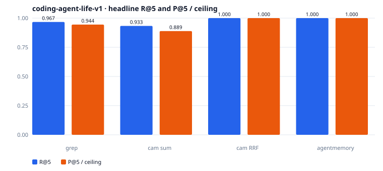
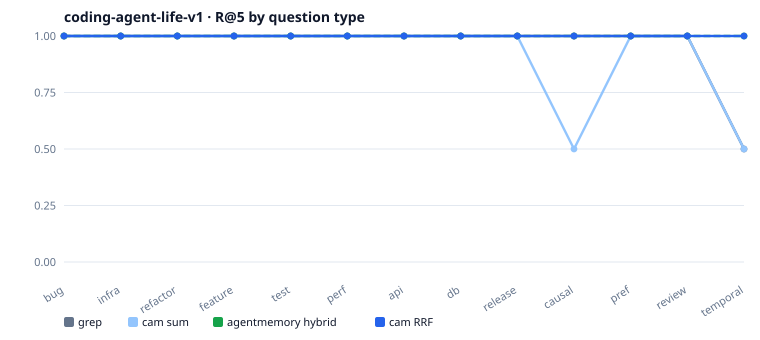
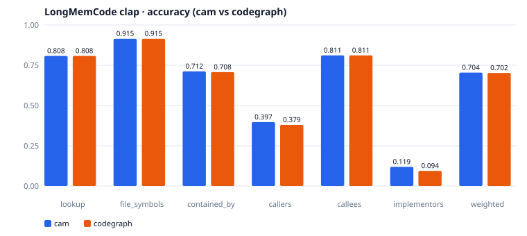
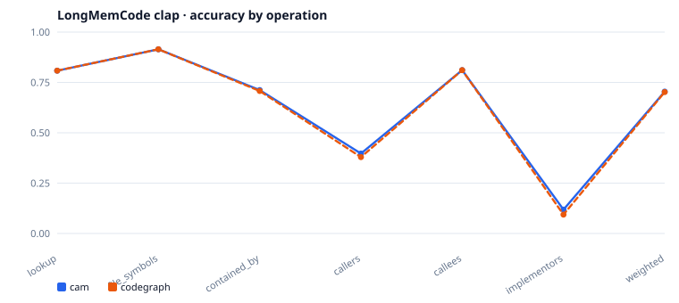
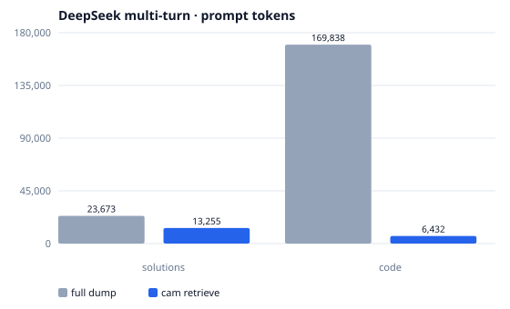
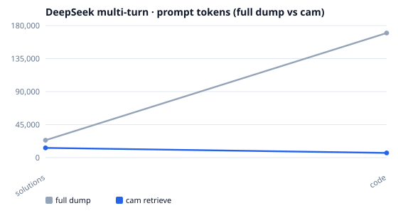

<div align="center">

# cam

[English](README.md) · [中文](README.zh.md)

### 给 Claude Code、Cursor、Codex、Windsurf、Copilot、JetBrains 一套能从 shell 查询的本地记忆

**代码图 + 记忆 · 按符号读代码 · 100% 本地 · 不接 MCP**

**内核用 Rust 写成**

[](https://opensource.org/licenses/MIT)
[](https://www.rust-lang.org/)
[](#开始)

[](#支持的平台)
[](#支持的平台)
[](#支持的平台)

[](#支持的-agent)
[](#支持的-agent)
[](#支持的-agent)
[](#支持的-agent)
[](#支持的-agent)
[](#支持的-agent)
[](#支持的-agent)
[](#支持的-agent)

</div>

## 目录

- [开始](#开始)
- [为什么需要 cam？](#为什么需要-cam)
- [评测](#评测)
- [能力](#能力)
- [原理](#原理)
- [Agent 怎么用](#agent-怎么用)
- [命令一览](#命令一览)
- [记忆规则](#记忆规则)
- [配置](#配置)
- [支持的平台](#支持的平台)
- [支持的 Agent](#支持的-agent)
- [支持的语言](#支持的语言)
- [许可证](#许可证)

## 开始

### 1. 安装 CLI

没有 Rust 先去 [rustup.rs](https://rustup.rs/) 装，然后：

```bash
cargo install --git https://github.com/HanochZhu/codeagent_memory --locked
cam --help
```

<details>
<summary><b>或者把这段丢给 AI（Cursor、Claude Code、Copilot …）</b></summary>

```text
请从 https://github.com/HanochZhu/codeagent_memory 安装 cam：先确认本机有 rustup/cargo，执行 `cargo install --git https://github.com/HanochZhu/codeagent_memory --locked`，把 ~/.cargo/bin（Windows 为 %USERPROFILE%\.cargo\bin）加入 PATH，用 `cam --help` 验证。然后在当前仓库执行 `cam init` 和 `cam index`。不要额外新建文件。
```

| 环境 | 怎么用这段话 |
| --- | --- |
| **Cursor** | Agent / Chat 里粘贴即可；它会自己开终端装 |
| **VS Code** + Copilot / Continue / Cline | 同样丢给 Chat / Agent |
| **Claude Code** / **Windsurf** / **Codex** | 对话里粘贴，让它跑 shell |
| **JetBrains** (IntelliJ / RustRover / GoLand) | AI Assistant 或内置终端执行同一条 `cargo install` |
| **本机终端** | 不需要 AI，直接跑上面的命令 |

<sub>安装会把 `cam` 放到 `~/.cargo/bin`（Windows：`%USERPROFILE%\.cargo\bin`），**不会刷新当前 shell** — 找不到命令就新开一个终端。</sub>

</details>

<details>
<summary><b>从本地克隆编译</b></summary>

```bash
git clone https://github.com/HanochZhu/codeagent_memory.git
cd codeagent_memory
cargo install --path . --locked
```

</details>

### 2. 初始化项目

```bash
cd your-project
cam init
cam index
```

<sub>`cam init` 创建 `.cam/` 并登记项目。`cam index` 用 tree-sitter 解析进 `.cam/cam.db`。分成两步是有意的：init 很轻，index 才是重活。</sub>

### 3. 先查图，再记下答案

```bash
cam ls src/
cam read src/main.rs/main
cam ref main --dir in
cam recall "how does hybrid recall fuse BM25 and vectors"
cam add --summary "..." < notes.md
```

到这里就够了 — Agent **只走 shell**，不用配 MCP。输出默认尽量短；要结构化结果就加 `--json`。

首次 `recall` / `add` 会下载 `potion-multilingual-128M`。模型不可用时回退 hash embedder。

---

## 为什么需要 cam？

Agent 理解代码、复用已经记下的项目结论时，通常靠 grep / glob / Read 一份份翻。下一轮对话又重来一遍。

**cam 给 Agent 两样东西，一条 shell 命令就能查：**

1. **代码图** — 已索引的文件和符号做成虚拟文件系统，外加一跳 callers / callees。
2. **记忆树** — 用户习惯、项目事实、设计方案、解法说明；用向量 + BM25 召回，避免把同一项目再学一遍。

按符号读，而不是整文件扫。记忆落在本地磁盘，100% 本地。

> Agent 只通过 shell 调 `cam`，不接 MCP。这是产品选择：一个二进制，所有 IDE 同一套命令，不用改 `mcp.json`。

---

## 评测

cam 有两面检索。每一面只和**同一语料上最近的开源系统**比，不要合成一张总分。

| 面 | 最近对照 | 共用基准 |
|---|---|---|
| 记忆 | [agentmemory](https://github.com/rohitg00/agentmemory) hybrid + 分词 **grep** | [coding-agent-life-v1](eval/coding_life/README.md) |
| 代码图 | [codegraph](https://github.com/colbymchenry/codegraph) | [LongMemCode](eval/longmemcode/README.md) clap |
| Token | 全文塞进上下文 | [DeepSeek 多轮](eval/llm_multiturn/README.md) |

Mem0、Zep、Letta 是通用会话记忆，没有跑过这两套语料，不进分数表。

### 机制对照

| | **cam** | **agentmemory** | **codegraph** |
|---|---|---|---|
| 存什么 | 代码图 + 记忆树 | 会话 / 聊天记忆 | 代码图 |
| 怎么查 | `recall` / `ls` / `read` / `ref` | smart-search / remember | `explore` / callers / callees |
| 接入 | **只走 shell** | MCP + REST + hooks | MCP + CLI |
| 融合 | 向量 + BM25 + **RRF** | BM25 + 向量 + rerank | FTS5 + 图遍历 |
| 本地 / 费用 | 100% 本地，检索 `$0` | 本地 server | 本地 |

### 记忆 — coding-agent-life-v1

15 段会话、15 条查询、k=5。计分与 agentmemory `score.ts` 相同。P@5 天花板 0.240。

| 系统 | Hit rate | R@5 | P@5 | 来源 |
|---|---|---:|---:|---|
| grep（分词子串） | 15 / 15 | 0.967 | 0.227 | 本树，2026-09-16 |
| cam `--fusion sum` | 15 / 15 | 0.933 | 0.213 | 本树，hash embed |
| **cam RRF**（默认） | **15 / 15** | **1.000** | **0.240** | 本树，hash embed |
| agentmemory hybrid | 15 / 15 | 1.000 | 0.240 | 已发表 v0.9.26 |





RRF 追平 hybrid 天花板，并在 `temporal`（q-015）上超过 grep。min-max 求和仍丢掉 `temporal` 和 `multi-session-causal`（q-011）的第二枚 gold。

### 代码图 — LongMemCode clap

clap v4.6.1，536 题，无 LLM。cam 一跳 vs codegraph，同一套 SCIP gold。

| 切片 | n | cam | codegraph |
|---|---:|---:|---:|
| supported（一跳） | 478 | **0.769** | 0.769 |
| lookup / file_symbols | 293 / 55 | 0.808 / 0.915 | 0.808 / 0.915 |
| callers / callees | 67 / 18 | **0.397** / **0.811** | 0.379 / 0.811 |
| implementors | 40 | **0.119** | 0.094 |
| raw / weighted | 536 | 0.709 / **0.704** | — / 0.702 |

P95 ≈ 6.5 ms，`$/1k` = 0。





### 多轮 token — DeepSeek

同一段对话跑两遍：系统提示里塞进全部 session / 全部 `src/*.rs`，或每轮只注入 `cam recall`（代码再加 `read` / `ref`）。hash embedder，2026-09-15。

| 线 | n | full 正确率 | cam 正确率 | full token | cam token | 节省 |
|---|---:|---:|---:|---:|---:|---:|
| 记忆（coding-agent-life） | 15 | 1.00 | **1.00** | 23673 | 13255 | **44%** |
| 代码（本仓 `cam index`） | 6 | 1.00 | 0.50 | 169838 | 6432 | **96%** |





平均每轮 prompt：记忆 1521 → 838；代码 28250 → 1004。代码线 miss 是检索缺口（`fuse_scores` 的 callers、`INITIAL_STABILITY_DAYS`、`cam add` 更新规则），不是模型没用片段。

```bash
python3 eval/coding_life/run.py --adapter grep
python3 eval/coding_life/run.py --hash-embed              # 默认 RRF
python3 eval/coding_life/run.py --hash-embed --fusion sum
python3 eval/llm_multiturn/run.py --track both   # 需要 DEEPSEEK_API_KEY
python3 eval/longmemcode/run.py --corpus clap
python3 eval/charts/generate.py
```

---

## 能力

| | |
|---|---|
| **SQLite 代码图** | tree-sitter 解析进 `.cam/cam.db` — 列目录、读符号、跳 callers/callees，不必打开整文件 |
| **虚拟路径** | `src/main.rs` 是文件；`src/main.rs/main` 是该文件里的符号 |
| **多路召回** | 向量 + BM25，默认 **RRF**（k=60）；`--fusion sum` 仍是 min-max 后求和 |
| **艾宾浩斯保留** | `R = exp(-t / S)` 加进召回分；过期和遗忘只打标，不删除 |
| **记忆树** | `add` 追加节点（可挂 `--parent`）；旧条目留在树上 |
| **只走 shell** | 不接 MCP。Cursor、Claude Code、Copilot、JetBrains 跑同一条 CLI |
| **100% 本地** | 无 API key。SQLite + 可选的本地向量模型（`~/.cam/models/`） |
| **5 种语言** | Rust、Python、TypeScript、JavaScript、Go |

---

## 原理

```
┌───────────────────────────────────────────────────────────────────┐
│                     Cursor / Claude Code / …                      │
│                                                                   │
│   「BM25 和向量的多路召回以前做过吗？」                             │
│       在 shell 里跑 `cam recall "..."` — 不接 MCP                  │
│                                 │                                 │
└─────────────────────────────────┬─────────────────────────────────┘
                                  │
                                  ▼
┌───────────────────────────────────────────────────────────────────┐
│                              cam CLI                              │
│                                                                   │
│  ls / read / ref     →  代码图（tree-sitter）                      │
│  recall / add / mem  →  记忆树（向量 + BM25 + FTS5）               │
│                                 │                                 │
│                                 ▼                                 │
│                       本地 SQLite  (.cam/cam.db)                  │
│          符号 · 边 · 记忆 · jieba + FTS5                          │
└───────────────────────────────────────────────────────────────────┘
```

1. **抽取** — tree-sitter 遍历项目，把节点（函数、类型）和边（调用）写入 SQLite。
2. **按需读** — `ls` / `read` / `ref` 走虚拟文件系统。`read` 给大纲或符号切片；`--full` 才整文件。
3. **召回** — `recall` 嵌入查询，跑 BM25（中文先 jieba），两路排序用 **RRF**（k=60）融合。`--fusion sum` 则各自归一后求和。再加上保留率 `R`。
4. **写回** — Agent 有需要长期留下的结论时，`add` 存摘要和正文。同一路径上新节点标 `latest`。

设计细节见 [DESIGN.md](DESIGN.md)。

---

## Agent 怎么用

探索仓库前先 `recall`；没有命中再读代码图；有需要长期留下的结论再 `add`。

```text
cam init
cam index
cam ls src/
cam read src/memory/recall.rs/fuse_scores
cam ref fuse_scores --dir in
cam recall "如何做 BM25 和向量的多路召回"
cam add --summary "..." --parent <id>
cam mem tree
cam mem show <id>
```

全局参数：`--json`、`--path <project>`。未指定 `--path` 时向上查找 `.cam` 或 `.git`。

---

## 命令一览

```bash
cam init [path]                          # 创建 .cam/ 并登记项目
cam index [path]                         # tree-sitter 解析进 SQLite
cam ls [virt_path]                       # 列目录 / 文件 / 符号
cam read <virt_path> [--full]            # 文件大纲或符号源码
cam ref <symbol> --dir in|out            # 一跳 callers (in) 或 callees (out)
cam recall "<query>" [--limit N] [--fusion rrf|sum]  # 多路召回：向量 + BM25，默认 RRF
cam add --summary "..." [--parent ID] [--file PATH]   # 写入记忆（正文：stdin 或 --file）
cam mem tree                             # 打印记忆树
cam mem show <id>                        # 查看一条记忆
```

| 命令 | 作用 |
| --- | --- |
| `cam init` | 创建 `.cam/`，登记当前项目 |
| `cam index` | tree-sitter 解析进 SQLite（`.cam/cam.db`） |
| `cam ls [path]` | 列目录 / 文件 / 符号 |
| `cam read <path>` | 文件大纲，或符号源码；`--full` 才整文件 |
| `cam ref <symbol> --dir in\|out` | 一跳 callers / callees |
| `cam recall "<一句话>"` | 向量 + BM25；默认 **RRF**（k=60）；`--fusion sum` 为 min-max 后求和 |
| `cam add --summary "..." [--parent ID]` | 写入记忆（正文来自 stdin 或 `--file`） |
| `cam mem tree` / `cam mem show <id>` | 浏览记忆树 |

虚拟路径：`src/main.rs` 是文件，`src/main.rs/main` 是该文件里的符号。

---

## 记忆规则

- 超过 `~/.cam/config.toml` 的 `stale_days`（默认 30）会标 `stale`
- 艾宾浩斯保留率 `R = exp(-t / S)` 会加进召回分；`R < 0.3` 标 `needs_update`
- 召回成功（`needs_update = false`）时刷新 C0，并把 `S *= 1.7`
- 记忆不删除。同路径多条并存时标 `latest`，采用更新的那条
- 需要更新时 `add` 新节点（可挂 `--parent`），旧节点留在树上
- 中文 BM25 先 jieba 再进 FTS5

---

## 配置

`~/.cam/config.toml`：

```toml
stale_days = 30
```

向量模型缓存在 `~/.cam/models/`。

---

## 支持的平台

`cam` 是 Rust 二进制。`cargo install` 在当前机器上编译：

| 平台 | 安装 |
|----------|---------|
| Windows | `cargo install --git … --locked` |
| macOS | `cargo install --git … --locked` |
| Linux | `cargo install --git … --locked` |

完整命令见 [开始](#开始)。

---

## 支持的 Agent

`cam` 是 shell CLI。能跑终端命令的 Agent 都能用，不用注册任何东西：

- **Claude Code**
- **Cursor**
- **Codex**
- **Windsurf**
- **GitHub Copilot**（VS Code Chat、Copilot CLI）
- **Continue** / **Cline**
- **JetBrains AI Assistant**（IntelliJ / RustRover / GoLand）

把 [一句话安装](#开始) 贴给 Agent，或自己跑 `cargo install`。

---

## 支持的语言

| 语言 | 扩展名 | 索引内容 |
|----------|-----------|-----------------|
| Rust | `.rs` | 函数、struct、enum、trait、调用 |
| Python | `.py` | 函数、类、调用 |
| TypeScript | `.ts`, `.tsx` | 函数、方法、类、调用 |
| JavaScript | `.js`, `.jsx` | 函数、方法、类、调用 |
| Go | `.go` | 函数、方法、struct、调用 |

---

## 许可证

MIT

---

<div align="center">

**写给 AI coding agent — Claude Code、Cursor、Codex、Windsurf、Copilot、JetBrains**

[报告问题](https://github.com/HanochZhu/codeagent_memory/issues) · [功能建议](https://github.com/HanochZhu/codeagent_memory/issues)

</div>
