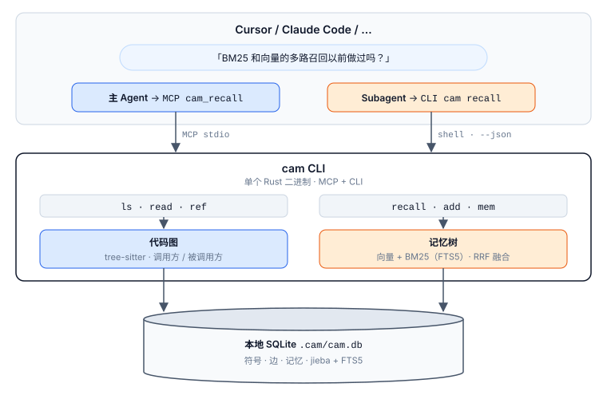

<div align="center">

# cam

[English](README.md) · [中文](README.zh.md)

### 更低的 token 消耗，更少的工具轮次 — 只需要一个本地记忆系统

**代码图 + 记忆 · 按符号读代码 · 100% 本地 · MCP + CLI**

**内核用 Rust 写成**

[](https://opensource.org/licenses/MIT)
[](https://www.rust-lang.org/)
[](#开始)

[](#支持的平台)
[](#支持的平台)
[](#支持的平台)

[](#支持的-agent)
[](#支持的-agent)
[](#支持的-agent)
[](#支持的-agent)
[](#支持的-agent)
[](#支持的-agent)
[](#支持的-agent)
[](#支持的-agent)

</div>

## 目录

- [为什么需要 cam？](#为什么需要-cam)
- [开始](#开始)
- [评测](#评测)
- [能力](#能力)
- [原理](#原理)
- [Agent 怎么用](#agent-怎么用)
- [命令一览](#命令一览)
- [记忆规则](#记忆规则)
- [配置](#配置)
- [支持的平台](#支持的平台)
- [支持的 Agent](#支持的-agent)
- [支持的语言](#支持的语言)
- [许可证](#许可证)

详细用法：[主 Agent 与 Subagent](docs/agents.zh.md) · [各 IDE 的 MCP 配置](docs/mcp.zh.md) · [English](docs/agents.md)

## 为什么需要 cam？

Agent 理解代码、复用已经记下的项目结论时，通常靠 grep / glob / Read 一份份翻。下一轮对话又重来一遍。

**cam 给 Agent 两样东西，一条 shell 命令就能查：**

1. **代码图** — 已索引的文件和符号做成虚拟文件系统，外加一跳 callers / callees。
2. **记忆树** — 用户习惯、项目事实、设计方案、解法说明；用向量 + BM25 召回，避免把同一项目再学一遍。

按符号读，而不是整文件扫。记忆落在本地磁盘，100% 本地。

> 一个二进制，两扇门：**主 Agent** 走 MCP（`cam mcp`）；**Subagent** 通常没有 MCP，跑同一套 CLI。配置见 [docs/mcp.zh.md](docs/mcp.zh.md)，用法见 [docs/agents.zh.md](docs/agents.zh.md)。

---

## 开始

### 1. 安装 CLI

没有 Rust 先去 [rustup.rs](https://rustup.rs/) 装，然后：

```bash
cargo install --git https://github.com/HanochZhu/codeagent_memory --locked
cam --help
```

<details>
<summary><b>或者把这段丢给 AI（Cursor、Claude Code、Copilot …）</b></summary>

```text
请从 https://github.com/HanochZhu/codeagent_memory 安装 cam：先确认本机有 rustup/cargo，执行 `cargo install --git https://github.com/HanochZhu/codeagent_memory --locked`，把 ~/.cargo/bin（Windows 为 %USERPROFILE%\.cargo\bin）加入 PATH，用 `cam --help` 验证。然后在当前仓库执行 `cam index`。给主 Agent 注册 MCP stdio：command 为 `cam`，args 为 `["mcp"]`（Cursor：.cursor/mcp.json；Claude Code：.mcp.json）。Subagent 在 shell 里跑 `cam --json`。不要额外写说明文档。
```

| 环境 | 怎么用这段话 |
| --- | --- |
| **Cursor** | Agent / Chat 里粘贴即可；它会自己开终端装 |
| **VS Code** + Copilot / Continue / Cline | 同样丢给 Chat / Agent |
| **Claude Code** / **Windsurf** / **Codex** | 对话里粘贴，让它跑 shell |
| **JetBrains** (IntelliJ / RustRover / GoLand) | AI Assistant 或内置终端执行同一条 `cargo install` |
| **本机终端** | 不需要 AI，直接跑上面的命令 |

<sub>安装会把 `cam` 放到 `~/.cargo/bin`（Windows：`%USERPROFILE%\.cargo\bin`），**不会刷新当前 shell** — 找不到命令就新开一个终端。</sub>

</details>

<details>
<summary><b>从本地克隆编译</b></summary>

```bash
git clone https://github.com/HanochZhu/codeagent_memory.git
cd codeagent_memory
cargo install --path . --locked
```

</details>

### 2. 建图

```bash
cd your-project
cam index
```

<sub>`cam index` 会在需要时自动创建 `.cam/`，再用 tree-sitter 解析进 `.cam/cam.db`。其它命令同样：第一次调用时自动创建 `.cam/`，不用手动跑。</sub>

### 3. 先查图，再记下答案

```bash
cam ls src/
cam read src/main.rs/main
cam ref main --dir in
cam recall "how does hybrid recall fuse BM25 and vectors"
cam add --summary "..." < notes.md
```

**主 Agent**（当前对话）：接一次 `cam mcp`，之后调 `cam_*` 工具。**Subagent**（Task / explore / 被委派的 CLI）：继续在 shell 里跑同一套命令。输出默认尽量短；要结构化结果就加 `--json`。

```json
{ "mcpServers": { "cam": { "command": "cam", "args": ["mcp"] } } }
```

贴到 Cursor 的 `.cursor/mcp.json`、Claude Code 的 `.mcp.json`，或宿主自己的 MCP 设置。分工具配置：[docs/mcp.zh.md](docs/mcp.zh.md)。谁走 MCP、谁走 CLI：[docs/agents.zh.md](docs/agents.zh.md)。

首次 `recall` / `add` 会下载 `potion-multilingual-128M`。模型不可用时回退 hash embedder。

---

## 评测

cam 有两面检索。每一面只和**同一语料上最近的开源系统**比，不要合成一张总分。

| 面 | 最近对照 | 共用基准 |
|---|---|---|
| 记忆 | [agentmemory](https://github.com/rohitg00/agentmemory) hybrid + 分词 **grep** | [coding-agent-life-v1](eval/coding_life/README.md) |
| 长期记忆 | BM25 / 稠密记忆检索 | [LongMemEval-S](https://github.com/xiaowu0162/LongMemEval) |
| 代码图 | [codegraph](https://github.com/colbymchenry/codegraph) | [LongMemCode](eval/longmemcode/README.md) clap |
| 工作流检索 | 词法 / BM25 文件检索 | [Agent Retrieval Bench V2](https://agent-retrieval-bench.github.io/) `edit2ripple` |
| Token | 全文塞进上下文 | [DeepSeek 多轮](eval/llm_multiturn/README.md) |

Mem0、Zep、Letta 是通用会话记忆，没有跑过这两套语料，不进分数表。

### 机制对照

| | **cam** | **agentmemory** | **codegraph** |
|---|---|---|---|
| 存什么 | 代码图 + 记忆树 | 会话 / 聊天记忆 | 代码图 |
| 怎么查 | `recall` / `ls` / `read` / `ref` | smart-search / remember | `explore` / callers / callees |
| 接入 | **MCP + CLI** | MCP + REST + hooks | MCP + CLI |
| 融合 | 向量 + BM25 + **RRF** | BM25 + 向量 + rerank | FTS5 + 图遍历 |
| 本地 / 费用 | 100% 本地，检索 `$0` | 本地 server | 本地 |

### 记忆 — coding-agent-life-v1

15 段会话、15 条查询、k=5。计分与 agentmemory `score.ts` 相同。P@5 天花板 0.240。

| 系统 | Hit rate | R@5 | P@5 | 来源 |
|---|---|---:|---:|---|
| grep（分词子串） | 15 / 15 | 0.967 | 0.227 | 本树，2026-09-23 |
| cam `--fusion sum` | 15 / 15 | 0.933 | 0.213 | 本树，hash embed |
| **cam RRF**（默认） | **15 / 15** | **1.000** | **0.240** | 本树，hash embed |
| agentmemory hybrid | 15 / 15 | 1.000 | 0.240 | 已发表 v0.9.26 |


RRF 追平 hybrid 天花板，并在 `temporal`（q-015）上超过 grep。min-max 求和仍丢掉 `temporal` 和 `multi-session-causal`（q-011）的第二枚 gold。

#### 修订链

上表用的是扁平语料：一段会话一条记忆，不挂 `--parent`。`--lineage` 会把每一轮对话都作为上一轮的一条修订重新灌入——也就是 cam 文档里的更新模型——并多出两个指标。**newest R@k** 看 top-k 里有没有带上每条 gold 链的最新节点；**stale `latest`** 数的是返回结果里明明已被更新的修订取代、却仍标着 `latest` 的条数。

| k | R@k | P@k | newest R@k | stale `latest` |
|---:|---:|---:|---:|---:|
| 5 | 0.967 | 0.227 | 0.567 | **0** |
| 10 | 1.000 | 0.120 | 0.800 | **0** |

`latest` 由一条递归 CTE 从数据库判定：沿 `parent_id` 上溯到链根再向下展开，所以链有多深都不影响结果。早先的版本按面包屑分组，在同样的这几轮里会标出 8–15 条过期的 `latest`。`--no-expand` 能复现上表每一个数字——链尾扩展只在某条修订与查询完全没有共同词时才会改变排序，而这个语料产生不出那种情况。hash embedder，2026-09-23。

### 长期记忆 — LongMemEval-S

使用清洗版 LongMemEval-S，以固定种子 42 抽取 100 个非拒答问题。每个带日期的原始会话存成一条记忆；检索使用 hash 向量 + RRF，k=10，不接大语言模型 reader。

| R@1 | R@5 | R@10 | Hit@1 | Hit@5 | Hit@10 | MRR |
|---:|---:|---:|---:|---:|---:|---:|
| 0.260 | 0.512 | **0.652** | 0.420 | 0.670 | **0.810** | 0.527 |

MRR = Mean Reciprocal Rank（平均倒数排名）。8 worker 并发运行时，召回 P50 / P95 为 1.28 / 2.18 秒，每题平均入库 69.6 秒。这是纯检索结果：只衡量 gold 会话能否被召回，不衡量最终回答质量。运行同时暴露了 `cam add` 反复初始化分词器是入库的主要耗时。

### 工作流检索 — Agent Retrieval Bench V2

`edit2ripple`：58 个锚定改动查询、44 个冻结仓库快照，无大语言模型。cam adapter 对锚定文件中各符号的图邻居文件排序。58 题全部计分；其中 55 个锚定文件属于已支持语言，3 个 Java 锚点按未命中保留。

| 系统 | Recall@5 | Recall@10 | Recall@20 | MRR | BCY@8k |
|---|---:|---:|---:|---:|---:|
| **cam 图邻居** | 0.292 | 0.320 | 0.364 | **0.291** | 0.292 |
| 词法检索 | **0.412** | **0.536** | **0.588** | 0.243 | **0.447** |
| BM25 | 0.207 | 0.287 | 0.499 | 0.154 | 0.243 |

BCY = Budgeted Context Yield（预算内上下文命中率），按基准官方的 8K Token 文件装箱协议计算。cam 图邻居的首个命中排名最好，但词法检索的 gold 覆盖明显更高；结果指向图与词法融合，而不是单独使用图检索。cam 查询 P95 为 11.6 ms；8 worker 建立 44 个快照索引耗时 327.6 秒。

### 代码图 — LongMemCode clap

clap v4.6.1，536 题，无 LLM。cam 一跳 vs codegraph，同一套 SCIP gold。

| 切片 | n | cam | codegraph |
|---|---:|---:|---:|
| supported（一跳） | 478 | **0.769** | 0.769 |
| lookup / file_symbols | 293 / 55 | 0.808 / 0.915 | 0.808 / 0.915 |
| callers / callees | 67 / 18 | **0.397** / **0.811** | 0.379 / 0.811 |
| implementors | 40 | **0.119** | 0.094 |
| raw / weighted | 536 | 0.709 / **0.704** | — / 0.702 |

P95 ≈ 6.5 ms，`$/1k` = 0。


### 多轮 token — DeepSeek

同一段对话跑两遍：系统提示里塞进全部 session / 全部 `src/*.rs`，或每轮只注入 `cam recall`（代码再加 `read` / `ref`）。hash embedder，2026-09-15。

| 线 | n | full 正确率 | cam 正确率 | full token | cam token | 节省 |
|---|---:|---:|---:|---:|---:|---:|
| 记忆（coding-agent-life） | 15 | 1.00 | **1.00** | 23673 | 13255 | **44%** |
| 代码（本仓 `cam index`） | 6 | 1.00 | 0.50 | 169838 | 6432 | **96%** |


平均每轮 prompt：记忆 1521 → 838；代码 28250 → 1004。代码线 miss 是检索缺口（`fuse_scores` 的 callers、`INITIAL_STABILITY_DAYS`、`cam add` 更新规则），不是模型没用片段。

下面所有脚本的语料位置都集中在一个文件 [eval/datasets.toml](eval/datasets.toml)。`coding-agent-life-v1` 不随仓库分发，默认指向与本仓库同级的 `agentmemory` 检出；改这个条目即可换位置，临时换一次用 `CAM_EVAL_CODING_LIFE` 覆盖。

```bash
python3 eval/coding_life/run.py --adapter grep
python3 eval/coding_life/run.py --hash-embed              # 默认 RRF
python3 eval/coding_life/run.py --hash-embed --fusion sum
python3 eval/longmemeval/run.py --sample 100 --seed 42 --workers 8
git clone --depth 1 https://github.com/eyuansu62/agent-retrieval-bench \
  eval/agent_retrieval/vendor/agent-retrieval-bench
python3 -m pip install -e eval/agent_retrieval/vendor/agent-retrieval-bench
arb download-benchmark --version v2_edit2ripple \
  --local-dir eval/agent_retrieval/data --force
python3 eval/agent_retrieval/run.py --workers 8
python3 eval/llm_multiturn/run.py --track both   # 需要 DEEPSEEK_API_KEY
python3 eval/longmemcode/run.py --corpus clap
python3 eval/charts/generate.py
```

---

## 能力

| | |
|---|---|
| **SQLite 代码图** | tree-sitter 解析进 `.cam/cam.db` — 列目录、读符号、跳 callers/callees，不必打开整文件 |
| **虚拟路径** | `src/main.rs` 是文件；`src/main.rs/main` 是该文件里的符号 |
| **多路召回** | 向量 + BM25，默认 **RRF**（k=60）；`--fusion sum` 仍是 min-max 后求和 |
| **链尾扩展** | 召回会把命中记忆所在修订链的最新一条一并拉进来，即使它两路都匹配不上，`latest` 始终是当前结论；`--no-expand` 可关闭 |
| **艾宾浩斯保留** | `R = exp(-t / S)` 加进召回分；过期和遗忘只打标，不删除 |
| **记忆树** | `add` 追加节点（可挂 `--parent`）；旧条目留在树上 |
| **MCP + CLI** | 主 Agent：`cam_*` 工具。Subagent：`cam --json …`。同一个二进制 |
| **100% 本地** | 无 API key。SQLite + 可选的本地向量模型（`~/.cam/models/`） |
| **5 种语言** | Rust、Python、TypeScript、JavaScript、Go |

---

## 原理



1. **抽取** — tree-sitter 遍历项目，把节点（函数、类型）和边（调用）写入 SQLite。
2. **按需读** — `ls` / `read` / `ref` 走虚拟文件系统。`read` 给大纲或符号切片；`--full` 才整文件。
3. **召回** — `recall` 嵌入查询，跑 BM25（中文先 jieba），两路排序用 **RRF**（k=60）融合。`--fusion sum` 则各自归一后求和。再加上保留率 `R`。命中记忆所在修订链的最新一条会一并拉进来，避免只返回一条已被取代的结论。
4. **写回** — Agent 有需要长期留下的结论时，`add` 存摘要和正文。同一条修订链上最新的节点标 `latest`。

设计细节见 [DESIGN.md](DESIGN.md)。

---

## Agent 怎么用

探索仓库前先 `recall`；没有命中再读代码图；有需要长期留下的结论再 `add`。

**主 Agent（MCP）：** `cam_recall` → `cam_ls` / `cam_read` / `cam_ref` → `cam_add`。MCP 可用时不要开 shell。全文：[docs/agents.zh.md](docs/agents.zh.md)。

**Subagent（CLI）：**

```text
cam --json index
cam --json ls src/
cam --json read src/memory/recall.rs/fuse_scores
cam --json ref fuse_scores --dir in
cam --json recall "如何做 BM25 和向量的多路召回"
cam --json add --summary "..." --body "..."
cam --json mem tree
cam --json mem show <id>
cam --json status
```

全局参数：`--project <dir>`、`--json`（紧凑 JSON）、`--pretty`（美化 JSON，隐含 `--json`）。未指定 `--project` 时依次用 `CAM_PROJECT`、向上查找 `.cam` / `.git`。`--json` 下失败会在 stdout 输出 `{"error":{"code":…,"message":…}}` 并返回非零退出码。MCP 服务：`cam mcp`（可加 `--project`）。

---

## 命令一览

```bash
cam index                                # tree-sitter 解析进 SQLite
cam watch [--debounce-ms N]              # 监听源文件；--json 每次 sync 输出一行
cam sync                                 # 按内容哈希增量更新图
cam ls [virt_path]                       # 列目录 / 文件 / 符号
cam read <virt_path> [--full]            # 文件大纲或符号源码
cam ref <symbol> --dir in|out            # 一跳 callers (in) 或 callees (out)；支持 --callers / --callees
cam recall "<query>" [--limit N] [--fusion rrf|sum] [--no-expand]  # 多路召回：向量 + BM25，默认 RRF
cam add --summary "..." [--parent ID] [--body TEXT | --file PATH]  # 写入记忆（正文：--body / --file / stdin）
cam mem tree                             # 打印记忆树
cam mem show <id>                        # 查看一条记忆
cam status                               # 当前项目、数据库统计与配置
cam config get | config set stale_days N # 读取或更新 ~/.cam/config.toml
cam mcp                                  # 主 Agent 用的 MCP stdio 服务
```

| 命令 | 作用 |
| --- | --- |
| `cam index` | tree-sitter 解析进 SQLite（`.cam/cam.db`）；没有 `.cam/` 时自动创建 |
| `cam sync` | 按内容哈希增量更新图 |
| `cam watch` | 文件监听，静默窗口后自动 `sync` |
| `cam ls [path]` | 列目录 / 文件 / 符号 |
| `cam read <path>` | 文件大纲，或符号源码；`--full` 才整文件 |
| `cam ref <symbol> --dir in\|out` | 一跳 callers / callees |
| `cam recall "<一句话>"` | 向量 + BM25；默认 **RRF**（k=60）；`--fusion sum` 为 min-max 后求和；`--no-expand` 关闭链尾扩展 |
| `cam add --summary "..." [--parent ID]` | 写入记忆（正文来自 `--body`、`--file` 或 stdin） |
| `cam mem tree` / `cam mem show <id>` | 浏览记忆树 |
| `cam status` | 当前项目根、数据库路径、节点/边/记忆数与配置 |
| `cam config get` / `cam config set stale_days N` | 读取或更新 `~/.cam/config.toml` |
| `cam mcp` | stdio MCP 服务（主 Agent）。见 [docs/mcp.zh.md](docs/mcp.zh.md) |

虚拟路径：`src/main.rs` 是文件，`src/main.rs/main` 是该文件里的符号。

---

## 记忆规则

- 超过 `~/.cam/config.toml` 的 `stale_days`（默认 30）会标 `stale`
- 艾宾浩斯保留率 `R = exp(-t / S)` 会加进召回分；`R < 0.3` 标 `needs_update`
- 召回成功（`needs_update = false`）时刷新 C0，并把 `S *= 1.7`。仅靠链尾扩展被拉进来的节点不算召回，不刷新
- 记忆不删除。结果按分数排序，每条修订链上最新的节点标 `latest` — 排第一的不一定是当前结论
- 需要更新时 `add` 新节点（可挂 `--parent`），旧节点留在树上
- 中文 BM25 先 jieba 再进 FTS5

---

## 配置

`~/.cam/config.toml`：

```toml
stale_days = 30
```

向量模型缓存在 `~/.cam/models/`。

---

## 支持的平台

`cam` 是 Rust 二进制。`cargo install` 在当前机器上编译：

| 平台 | 安装 |
|----------|---------|
| Windows | `cargo install --git … --locked` |
| macOS | `cargo install --git … --locked` |
| Linux | `cargo install --git … --locked` |

完整命令见 [开始](#开始)。

---

## 支持的 Agent

**主 Agent：** 注册 `cam mcp`（stdio）。**Subagent：** 同一套 CLI，不用再配。

| 宿主 | MCP 配置 | 说明 |
| --- | --- | --- |
| Cursor | `.cursor/mcp.json` 或 `~/.cursor/mcp.json` | Task / explore 走 CLI |
| Claude Code | `.mcp.json` / `~/.claude.json` / `claude mcp add` | 工具被裁过的 subagent 走 CLI |
| Codex | `~/.codex/config.toml` → `[mcp_servers.cam]` | `codex exec` 走 CLI |
| Windsurf | `~/.codeium/windsurf/mcp_config.json` | Cascade = MCP |
| GitHub Copilot | `.vscode/mcp.json` / `~/.copilot/mcp-config.json` | Chat = MCP；脚本 = CLI |
| Continue | `~/.continue/config.yaml` | |
| Cline | `~/.cline/mcp.json` | |
| JetBrains | AI Assistant → MCP | PATH 为空时写 `cam.exe` 绝对路径 |
| Gemini CLI / Antigravity / OpenCode / Zed / Droid | 见 [docs/mcp.zh.md](docs/mcp.zh.md) | |

把 [一句话安装](#开始) 贴给 Agent，再补上 MCP 配置。分工具文件：[docs/mcp.zh.md](docs/mcp.zh.md)。提示词：[docs/agents.zh.md](docs/agents.zh.md)。

---

## 支持的语言

| 语言 | 扩展名 | 索引内容 |
|----------|-----------|-----------------|
| Rust | `.rs` | 函数、struct、enum、trait、调用 |
| Python | `.py` | 函数、类、调用 |
| TypeScript | `.ts`, `.tsx` | 函数、方法、类、调用 |
| JavaScript | `.js`, `.jsx` | 函数、方法、类、调用 |
| Go | `.go` | 函数、方法、struct、调用 |

---

## 许可证

MIT

---

<div align="center">

**写给 AI coding agent — Claude Code、Cursor、Codex、Windsurf、Copilot、JetBrains**

[报告问题](https://github.com/HanochZhu/codeagent_memory/issues) · [功能建议](https://github.com/HanochZhu/codeagent_memory/issues)

</div>
