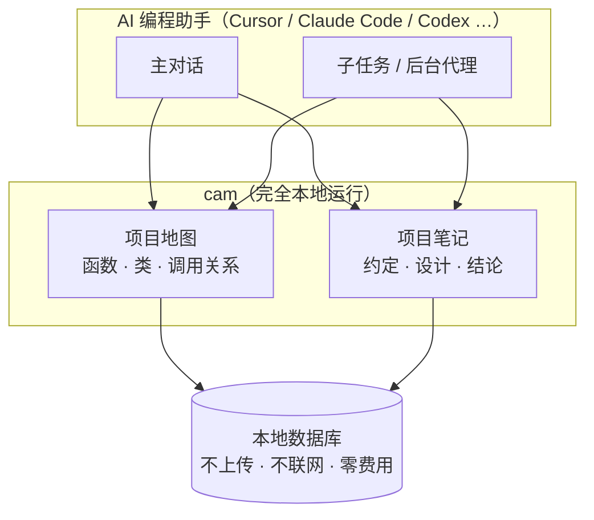
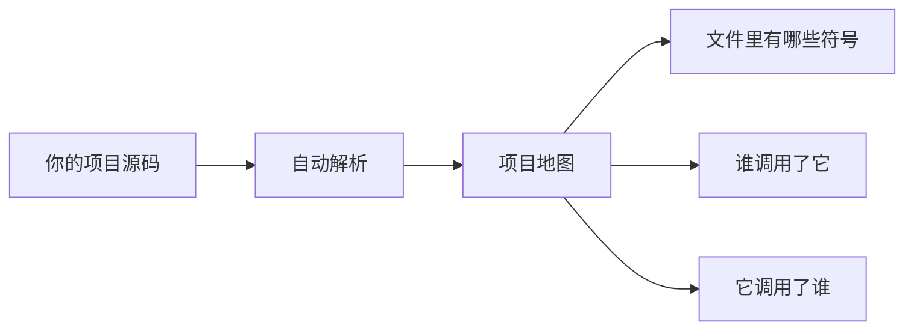
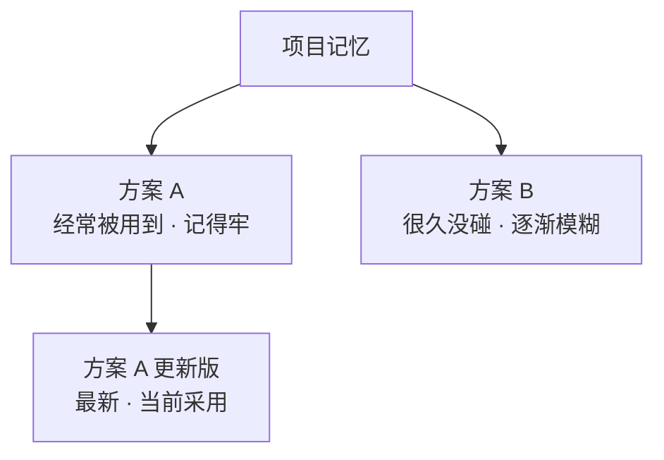
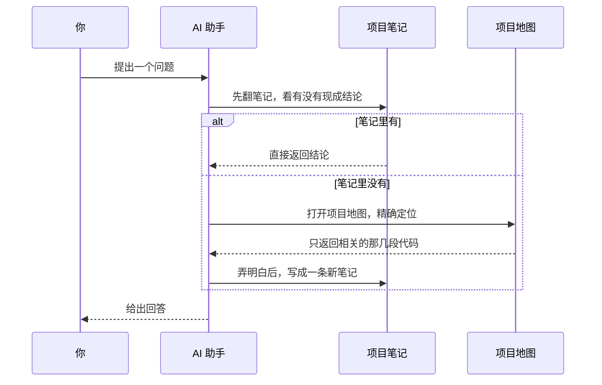

# 【工具推荐】cam：给 AI 编程助手装一套"本地记忆"

## 前言

最近几年，我写代码越来越离不开 AI 助手了。但用得越久，一个别扭的地方就越明显：

> **它记性太差，而且对我手里的项目几乎一无所知。**

同一件已经讨论清楚的事情，换一轮对话，它忘得干干净净；想找一段代码，它不会直接定位，而是一个文件一个文件地翻，翻完还不一定找对。感觉它就像个刚入职的新人，每天都从零开始认识我的项目。

这个问题我想了很久，后来慢慢想明白：AI 助手其实缺两样东西——**一张项目的"地图"，和一份项目的"笔记"。** 前者让它知道代码长什么样，后者让它记住我们得出过什么结论。

cam 就是围绕这两件事做的一个小工具。

## AI 编程中的"失忆症"

先说说我遇到的几个典型场景，可能你也有同感。

- **找代码**：我问"这个函数被谁调用了"，AI 不会直接回答，而是 grep 一圈、打开好几个文件、扫一遍内容，最后才给出答案。它没有项目的结构概念，只能靠最原始的方式"翻"。
- **重复劳动**：上一轮刚说清楚"这个模块的设计思路是这样，不要再改成那样"，下一轮它又忘了，我又得解释一遍。
- **花销**：项目一大，每次提问都要把大量相关代码塞进上下文，token 哗哗地烧，很多内容其实这次根本用不上。

说到底，AI 缺少对项目的**整体认知**，也缺少跨对话的**长期记忆**。

## cam 是什么

cam 是一个本地运行的小工具，它给 AI 助手补上正好缺的那两样东西。

**第一样，是一张项目的"地图"。** 它会把代码里的函数、类、调用关系整理清楚。AI 拿到地图以后，想知道某个函数在哪、被谁调用、又调用了谁，都能直接定位，不用把整个文件从头读到尾。

**第二样，是一份项目的"笔记"。** 那些代码里写不下、但很重要的事——项目约定、设计方案、踩过的坑、最后的结论——都记在这里。下次再问，AI 先翻笔记，有现成的就直接用。

一句话概括：

> **AI 想知道什么，问它；AI 想记住什么，交给它。** 而且这一切都在你自己的电脑上完成。

## 项目地图：让 AI 不再翻箱倒柜

过去的 AI 找代码，就像在图书馆里一本本翻书：打开、扫一遍、换下一本。

有了地图之后，读代码变成了"顺着关系找"。它看到的不是一堆孤立的文件，而是一张网：

- 一个文件里有哪些函数和类；
- 这些函数分别被谁调用；
- 它们又调用了谁。

于是 AI 可以只读"需要的那几页"，而不是碰运气似地翻整个书架。**读得少，自然答得快，也更省钱。**

这张地图还有一个好处：它会安静地跟着你的项目走。你改代码，它自己更新，不需要你操心维护。支持的编程语言目前有 Rust、Python、TypeScript、JavaScript、Go、Java、C、C++ 和 C#。

## 项目笔记：把结论留下来

地图解决的是"代码长什么样"，笔记解决的是"这个项目我们想明白了什么"。

有些经验是代码里没有的。比如某块逻辑以前踩过坑，比如某个方案最后为什么被放弃，比如团队约定的一套写法。这些用对话讲一遍，下一轮就没了。cam 把它们记成笔记，长期保存，AI 每次开工前先看一眼，就能少走很多弯路。

我特别喜欢它对"遗忘"的处理方式，很像人脑：

> **越常用的记得越牢，越久不碰的越模糊。**

久没被用到的笔记会被提醒"可能过时了"，让 AI 重新确认一下；但笔记**永远不会被删掉**，旧的结论和新的结论都留在原地，最新的那条才是当前答案。这样既保证 AI 用的总是最新结论，又不怕历史经验找不回来。

## 架构长什么样

说了这么多，不如直接看图。下面几张图把 cam 的整体结构画了出来。

### 整体结构

左边是 AI 助手，中间是 cam，右边是它保管的两样东西——地图和笔记，全部落在本地。

### 地图是怎么来的

cam 会读懂你的源码，把它拆成"文件 → 符号 → 调用关系"这样一张网。

### 笔记与遗忘

笔记是树状生长的：新旧结论都挂在同一棵树上，谁也不会被删掉；常用的记得牢，久不用的慢慢变模糊。

### 一次提问的完整流程

把上面几块串起来，就是 AI 每次回答你时，背后大致发生的事。

## 几点让我觉得省心的地方

- **本地、免费、隐私安全**：所有数据都在自己电脑里，不用联网调用大模型接口，代码和笔记不会外传。
- **自动跟随项目变化**：改完代码它自己更新，不需要手动维护。
- **支持多种语言**：Rust、Python、TypeScript、JavaScript、Go、Java、C、C++、C# 都能读懂。
- **对 AI 友好**：主对话也好，被派出去干活的子任务也好，都能用上同一套能力。
- **贴合 AI 的工作方式**：它不是给程序员手动敲命令用的，而是专门设计成 AI 能直接调用的工具。

## 效果怎么样

从公开数据集的测试结果看，大致是这样：

- **找回笔记**：15 条查询里命中 15 条，达到同类开源方案的领先水平；
- **看懂代码**：在 500 多道代码关系题上，找调用关系、找实现类的准确率与专门的代码图工具持平甚至更好，响应只要几毫秒；
- **省 token**：同一段多轮对话，平均省下约 **44%** 的 token；在代码场景下甚至能省 **96%**，而回答正确率基本不掉。

对天天用 AI 写代码的人来说，这些是实实在在的时间和成本。

## 讨论

写到这里，我想把最开始的问题再抛出来：

> **AI 到底需不需要"记住"你的项目？**

从我的使用体验看，答案是需要的。但这套记忆应该记什么、记多久、什么时候更新，其实还挺值得琢磨。cam 给出的答案是不删、按时间淡忘、最新结论优先——不一定是最优解，但至少是一个务实的开始。

如果你也在用 AI 写代码，不妨想想：你最希望 AI 记住你项目的哪件事？

## 后记

cam 想做的事情其实很朴素：

> **让 AI 在理解一个项目时，既有地图，又有记性，而这一切都留在你自己的电脑里。**

它不喧哗、不折腾，只是默默把 AI 从"每次重新认识你"变成"越用越懂你"。

项目地址：https://github.com/HanochZhu/codeagent_memory

如果内容有错误，或者你对这个话题感兴趣，欢迎一起讨论。

## 参考

- cam 项目地址：https://github.com/HanochZhu/codeagent_memory
- 设计文档：https://github.com/HanochZhu/codeagent_memory/blob/main/DESIGN.md

---

*如果这篇文章对你有启发，欢迎点赞收藏；也欢迎去 GitHub 点个 Star 或提 Issue。*
